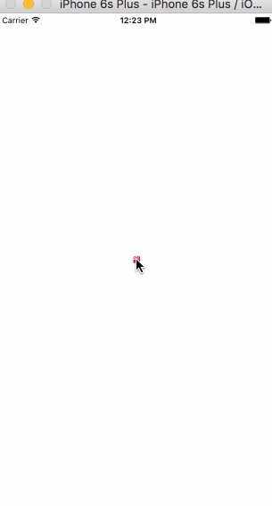
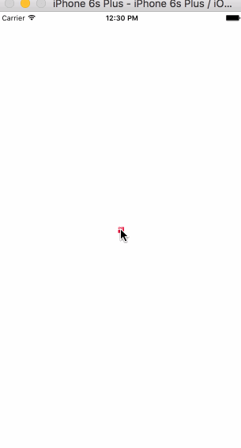

# Inerpolation

Interpolation is KEY to having great animations. There are many ways to interpolate and we'll cover as many as we can here.

Interpolating with `Animated` can allow us to bind to our `Animated.Value`s that we create and change the output. So for example, maybe as a user scrolls or drags a card around you can interpolate from that `Animated.Value` and change things like the background color and or rotation.

Not only can you do colors and rotation but you can scale down or scale up values. Setting an `inputRange` and subsequent `outputRange` can allow you to adjust the values.

For example maybe you want the opacity to also be bound to the dragging of a card.

You could accomplish that like so

```
this._animatedValue = new Animated.ValueXY();

this._opacityAnimation = this._animatedValue.x.interpolate({
	inputRange: [0, 150],
	outputRange: [1, .2]
});
```

The `this._opacityAnimation` can be used just like an `Animated.Value` and can be passed into any `Animated.View` and or Animated component. What the interpolation in this case is doing is as the `x` value in our `_animtedValue` increases from `0` to `150` it is determine the step and subsequent `outputRange` between `1` and `.2`.

So when our `x` value is 0, our interpolated opacity value will be `1`, at `150` it will be `.2`, and when it's at `75` it'll be `.4` opacity.

You may be thinking to yourself, well what if the user moves the card more than `150`? Well some users may think it will automatically stop and our `_opacityAnimation` will stay at `.2`. That isn't the case be default.

You must specify how the interpolation should be extrapolated. If you want it to stop at `.2` no matter how far the `x` goes than you must specify `extrapolate:'clamp'` like os.

```
this._opacityAnimation = this._animatedValue.x.interpolate({
	inputRange: [0, 150],
	outputRange: [1, .2],
	extrapolate: 'clamp'
});
```

Clamp is VERY IMPORTANT to remember as you may have unintended side effects, especially when dealing with colors and rotation.

Additioanlly you must pass in the same amount of values in `inputRange` and `outputRange`. This can be weird as you may find yourself duplicating some values in `outputRange` occasionally. I've mostly run into this sort of thing when dealing with colors.

## Extrapolate

Alright we just talked about `extrapolate` however we have a few other options.

The 3 options we have are `clamp`, `identity`, and `extend`. Extend is the default which may seem obvious, but as stated it will continue the interpolation past the end value at whatever the current step is.

```
type ExtrapolateType = 'extend' | 'identity' | 'clamp';

extrapolate?: ExtrapolateType;
extrapolateLeft?: ExtrapolateType;
extrapolateRight?: ExtrapolateType;
```

We also have more than just `extrapolate`. We have access to what the interpolation does when animating `left => right` and additionally when animating from `right => left`.

That may seem confusing so let me explain. Take this as an example

```
this._animatedValue = new Animated.Value(0);

var scaleAndFlipOnReverse = this._animatedValue.y.interpolate({
  inputRange: [0, deviceHeight],
  outputRange: [.1, 2],
  extrapolateLeft: 'extend',
  extrapolateRight: 'clamp'
});

<Animated.View style={{transform: [{scale: scaleAndFlipOnReverse}]}} />
```

#### Clamp/Extend
So assume a user is dragging a sqaure, and if the square is moved from the `0` postion to `100` then it will quickly scale the the square from `.1` to `2` ( double its full size) and stop.
However if we go in the reverse direction and drag it back from `100` down to `0` positin and then beyond it will continue to scale down and to a negative value eventually.
This will cause it to flip! This is showing that when we hit our top level (moving to the right) it will `clamp` and then moving downwards (towars the left) it will just extend and grow.



##### Live Code [https://rnplay.org/apps/FVf7Pw](https://rnplay.org/apps/FVf7Pw)

#### Clamp/Identity
How about when we do an `identity`? 

Well what that will do is bypass everything! Easings, etc. Once it hits the boundaries of your `inputRange` and `outputRange` whatever the input happens to be will become the value.

```
this._animatedValue = new Animated.Value(0);

var scaleAndFlipOnReverse = this._animatedValue.y.interpolate({
  inputRange: [0, deviceHeight],
  outputRange: [.1, 2],
  extrapolateLeft: 'identity',
  extrapolateRight: 'clamp'
});

<Animated.View style={{transform: [{scale: scaleAndFlipOnReverse}]}} />
```

What will happen here is as we move right it will `clamp` at a scale of `2`. However once we get down passed `0` it will take on whatever the value of our `this._animatedValue` happens to be! In our case if we are dragging it could go from `0` to a VERY large value as the user drags. You can see that here in this gif. I am unsure about a practical application for this but I'm sure there is one I have yet to run into.



##### Live Code [https://rnplay.org/apps/Bmya8g](https://rnplay.org/apps/Bmya8g)


## Handy Technique - .99

The Animated library and interpolation is great, but it does have some downfalls. Sometimes you want to in essense trigger a `setValue` but if you are specifying an `inputRange` and `outputRange` all of these values will be animated to. 

In our opacity case it will always slowly step the animation down from `1` to `.2`. What if you want to have a drop off cliff. Like if the user moves it `75` it should immediately drop to `.2` opacity. 

Well on technique is to define something at `.99` before your cutoff. So in our case the user can drag all the way up to `74.99` and it'll slowly fade out to `.8` opacity, however as soon as it creeps over from `74.99` to `75` it will immediately drop to `.2` opacity.

Code example 

```
this._opacityAnimation = this._animatedValue.x.interpolate({
	inputRange: [0, 74.99, 75],
	outputRange: [1, .8, .2],
	extrapolate: 'clamp'
});
```

This shows how flexible and inflexible the `Animated` library is. However it's a pseudo hacky way to define arbitrary ranges of values.