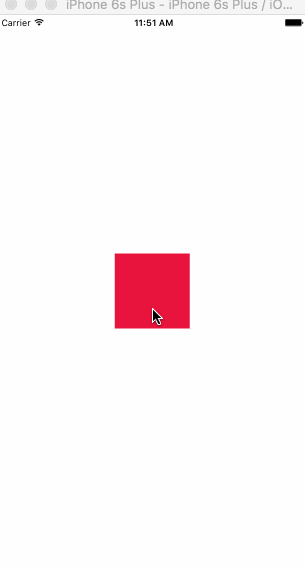

# Drag Square Animation

#### Live Code [https://rnplay.org/apps/m_t0yQ](https://rnplay.org/apps/m_t0yQ)



Alright, we learned about moving squares, interpolating colors, interpolating on rotation. Now lets combine them and add a drag.

The main concept here is the drag, but we'll see some usage of `Dimensions` which helps us get the device dimensions so we can adjust our interpolations to the draggable areas.


```
var React = require('react-native');
var {
  AppRegistry,
  StyleSheet,
  Text,
  View,
  PanResponder,
  Animated,
  Dimensions
} = React;

var {
  height: deviceHeight,
  width: deviceWidth
} = Dimensions.get('window');

var SampleApp = React.createClass({
  
  componentWillMount: function() {
    this._animatedValue = new Animated.ValueXY()
    this._value = {x: 0, y: 0}
    
    this._animatedValue.addListener((value) => this._value = value);
    this._panResponder = PanResponder.create({
        onMoveShouldSetResponderCapture: () => true, //Tell iOS that we are allowing the movement
        onMoveShouldSetPanResponderCapture: () => true, // Same here, tell iOS that we allow dragging
        onPanResponderGrant: (e, gestureState) => {
          this._animatedValue.setOffset({x: this._value.x, y: this._value.y});
          this._animatedValue.setValue({x: 0, y: 0});
        },
        onPanResponderMove: Animated.event([
          null, {dx: this._animatedValue.x, dy: this._animatedValue.y}
        ]), // Creates a function to handle the movement and set offsets
        onPanResponderRelease: () => {
          this._animatedValue.flattenOffset(); // Flatten the offset so it resets the default positioning
        }
      });
  },
  render: function() {

    var interpolatedColorAnimation = this._animatedValue.y.interpolate({
      inputRange: [0, deviceHeight - 100],
      outputRange: ['rgba(229,27,66,1)', 'rgba(90,146,253,1)'],
      extrapolate: 'clamp'
    });

    var interpolatedRotateAnimation = this._animatedValue.x.interpolate({
      inputRange: [0, deviceWidth/2, deviceWidth],
      outputRange: ['-360deg', '0deg', '360deg']
    });

    return (
      <View style={styles.container}>
        <Animated.View 
          style={[
              styles.box, 
              {
                transform: [
                  {translateX: this._animatedValue.x},
                  {translateY: this._animatedValue.y},
                  {rotate: interpolatedRotateAnimation}
                ],
                backgroundColor: interpolatedColorAnimation
              }
            ]} 
            {...this._panResponder.panHandlers} 
          />
      </View>
    );
  }
});

var styles = StyleSheet.create({
  container: {
    flex: 1,
    alignItems: 'center',
    justifyContent: 'center'
  },
  box: {
    width: 100,
    height: 100
  }
});


AppRegistry.registerComponent('SampleApp', () => SampleApp);

```