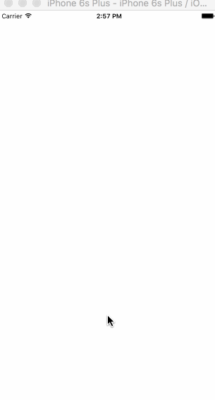

# Scroll

There are 2 scroll components `ListView` and `ScrollView`. `ScrollView` more commonly used for small amounts of content when performance is less important, and `ListView` when you're rendering large amounts of content and performance matters.

One thing that they both provide is an `onScroll` function, and additionally you need to provide a `scrollEventThrottle` which will call the `onScroll` at a throttled rate. Typically that value should be set to `16` to receive all scroll events, otherwise put it higher if you care less.


The `event.nativeEvent` will have a JSON structure like so. 

```
{
    "contentOffset": {
        "x": 0,
        "y": 2395.333333333333
    },
    "layoutMeasurement": {
        "width": 414,
        "height": 736
    },
    "contentSize": {
        "width": 414,
        "height": 5000
    },
    "zoomScale": 1,
    "updatedChildFrames": [],
    "contentInset": {
        "right": 0,
        "top": 0,
        "left": 0,
        "bottom": 0
    }
}
```
The one thing to call out is the `contentSize` and the `contentOffset`. The `contentSize` will have the height of all rendered content inside of it, and the `contentOffset` will provide a current `x` and `y` of how far things have scrolled. You can have `horizontal`, `ListView`s and `ScrollView`s which is where the `x` distance comes into play.

As an example lets say you want to change the background color of a view on scroll. 

```
var SampleApp = React.createClass({
  componentWillMount: function() {
    this._animatedValue = new Animated.Value(0);
  },
  render: function() {
    var interpolatedColor = this._animatedValue.interpolate({
      inputRange: [0, 5000],
      outputRange: ['rgba(255,255,255,1)', 'rgba(51,156,177, 1)'],
      extrapolate: 'clamp'
    });

    var event = Animated.event([
      {
        nativeEvent: { 
          contentOffset: {
            y: this._animatedValue
          }
        }
      }
    ])

    return (
      <View style={styles.container}>
        <ScrollView style={{flex: 1}} onScroll={event} scrollEventThrottle={16}>
          <Animated.View style={{height: 5000, backgroundColor: interpolatedColor}} />   
        </ScrollView>
      </View>
    );
  }
});
```

We setup our `_animatedValue` and create our `interpolate` that spans the range of our content. In our case we've defined it as `5000`, so this is slightly impracticle. But that's what `extrapolation` is for! In our case we'll clamp it but it might make sense to leave it as the default `extend` here.

Now we use [Animated.event](../api/EVENT.md) to map our event from the JSON, to the `contentOffset.y` which is the distance the user has scrolled. Then we can simply pass that into the `onScroll` and as the user scrolls it'll automatically call `setValue` on our `this._animatedValue` which will cause the `interpolate` to control the background color.

The result would look something like this.


